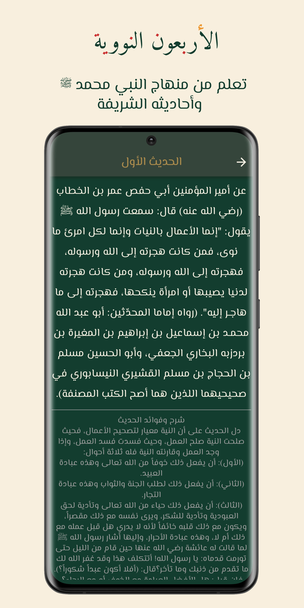
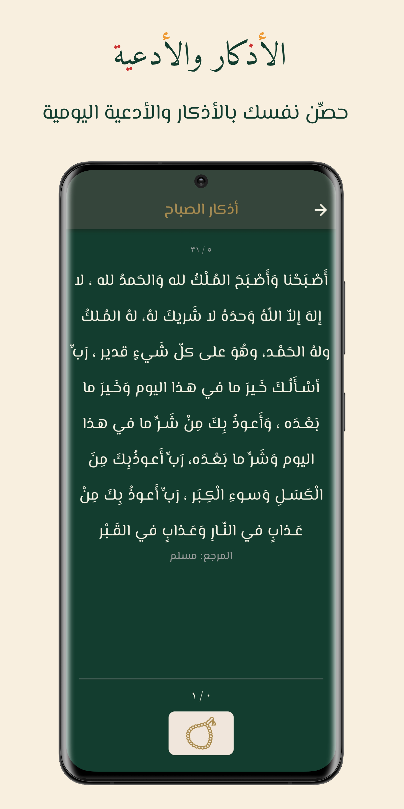

# El Muslim App
***

  

El Muslim is your daily guide to Islamic practices and beliefs, providing a comprehensive resource for reading the Holy Quran, the Forty Hadiths an-Nawawi, and daily supplications. With a user-friendly interface and night mode option, the app is optimized for a variety of screen sizes for easy reading on your phone or tablet.
***

## Features

- Reading the Holy Quran with easy navigation between surahs and verses, and the ability to bookmark pages for easy access later, and search its verses.
- Collection of Forty Hadiths an-Nawawi for guidance on various aspects of Islamic life.
- Prayer times from user location (requires internet connection and access permission to user location).
- Daily supplications for morning and evening, bedtime, and other times, as well as the ability to add custom adhkar and manage them from a dedicated list.
- Improved experience of Quran reading for a smoother and more enjoyable experience.
- Night mode for a customized reading experience.
- Fully responsive and optimized for a variety of screen sizes.
***

## Technical Details

- The app has been built using clean architecture principles.
- The MVVM design pattern has been used for app architecture. 
- Cubit from BLoC has been used as a state management library.
- Native splash screen has been implemented. 
- Shared preferences have been used to cache user preferences about language and theme mode.
- Floor database has been used to save user custom adhkar.
***

## Screenshots
 

  
  
  
  
  
  
  

## Installation

To install El Muslim App, follow these steps:

1. Download the APK file from [Google Play](https://play.google.com/store/apps/details?id=com.abdoSamehDev.elmuslim_app).
2. Enable installation from unknown sources on your device.
3. Open the APK file and follow the installation prompts.
***

## Getting Started

To get started with El Muslim App, simply open the app and start exploring its features. Use the scrollable listview to move between surahs and verses, and choose from the various supplications available.
***

## Troubleshooting

If you encounter any issues while using El Muslim App, try the following troubleshooting steps:

- Check for updates to the app and install them if available.
- Try restarting the app or your device.

If these steps do not resolve the issue, please contact us at **_abdosamehdev@gmail.com_** for further assistance.
***

## Contact Information

For questions or feedback on El Muslim App, please contact us at **_abdosamehdev@gmail.com_**.
***

## Attributions

We would like to thank the following sources for their contributions to El Muslim App:

- Quran data from [Quran Database](http://api.alquran.cloud/v1/quran/quran-uthmani)
- Hadith data from [Hadith Database](https://github.com/osamayy/40-hadith-nawawi-db/blob/main/40-hadith-nawawi)
- Prayer times API from [Prayer times API](https://api.aladhan.com/v1/timingsByCity/29-05-2023?city=Suez&country=Egypt)
- Azkar data from [Azkar Database](https://github.com/osamayy/azkar-db/blob/master/azkar.json)
- Quran Icon from [Quran Icon](https://www.svgrepo.com/svg/52891/quran-rehal)
- Mosque Icon from [Mosque Icon](https://iconscout.com/icon/mosque-1626512)
- Hadith Icon from [Hadith Icon](https://iconscout.com/icon/ornament-3376032)
- Tasbih Icon from [Tasbih Icon](https://iconscout.com/icon/muslim-3)
***

## Version History

# v1.2.0
- Added prayer times (requires internet connection and access permission to user location).
- Added Quran search feature.
- Edited hadiths titles and enhanced the app.

# v1.1.0
- Improved the experience of Quran reading.
- Added quran page bookmark feature to save where the user stops reading.
- Added a feature that allows the user to add custom adhkar and access them from a custom adhkar list (also can delete a dhikr if they no longer want it in their custom adhkar list).

# v1.0.0
- Initial release.
***

## Legal

This application is open source under the [MIT License](https://opensource.org/license/mit/), which means that you can use its source code for any purpose, including commercial applications, as long as you provide attribution. Please refer to the license file for more information.

Note: This license applies only to the source code of the application and not to its contents, such as the Holy Quran or other copyrighted material.
***
